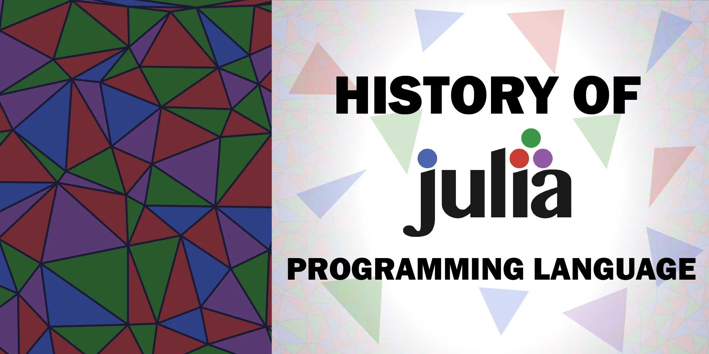

# The Julia Language crash course for chemists

**About Julia**

Julia is a new programming language developed for scientific and numerical programming. As a chemist, how can we use this new tool to improve and implement techniques for molecular modelling? At the end of this workshop, you will be able to answer that question and start using Julia for your research.

**Course Program**

#### Day 1

- [x] Introduction to Julia
- [x] Julia community
- [x] Configuring Julia set up
- [x] Julia basics (syntax)
- [x] Julia basics (types)
- [x] Julia basics (functions)
- [x] Julia basics (packages)
- [x] Julia basics (multiple dispatch)

#### Day 2

- [x] Data Structures in Julia
- [x] Plotting in Julia
- [x] Scientific plotting

#### Day 3

- [x] Numerical computing
- [x] Parallelization
- [x] GPU computing

#### Day 4

- [x] Molecular modelling
- [x] Molecular dynamics
- [x] Quantum chemistry

#### Day 5

- [x] Machine learning
- [x] Deep learning

**How to use this repository**

This repository contains the material used in the workshop. You can clone it and follow the instructions in the `README.md` file. All questions will be opened as issues in this repository, so everybody can see the answers and discuss them. The purpose of this environment is to be friendly and healthy for everyone, so please be kind and respectful. It is okay if we don't have the answer for everything, but we can always try to find it together.

**Resources to lern more**

- [Julia Language repository](https://github.com/JuliaLang/julia)
- [Julia language documentation](https://julialang.org)
- [Julia Discourse](https://discourse.julialang.org)
- [Forem](https://forem.julialang.org)
- [JuliaMolSim](https://github.com/JuliaMolSim)

**About Me**

Leticia Madureira is a quantum chemist and computer scientist trying to solve problems with computers, from math background to machine learning predictions. She currently does scientific divulgation on Github and Youtube as an active contributor to Julia language. She has just started her PhD at CMU (Carnegie Mellon University) and joined Gomes group.  

- [My Youtube channel](https://www.youtube.com/channel/UCjGH-n0jtFDtaWAfC0LEE6w)
